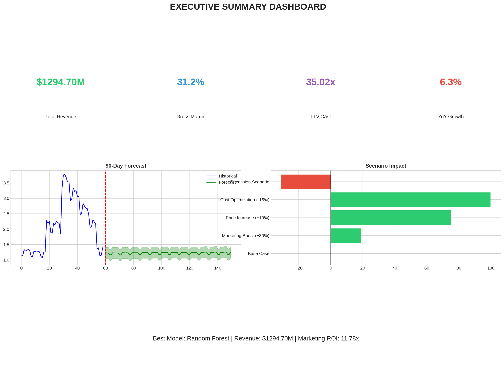
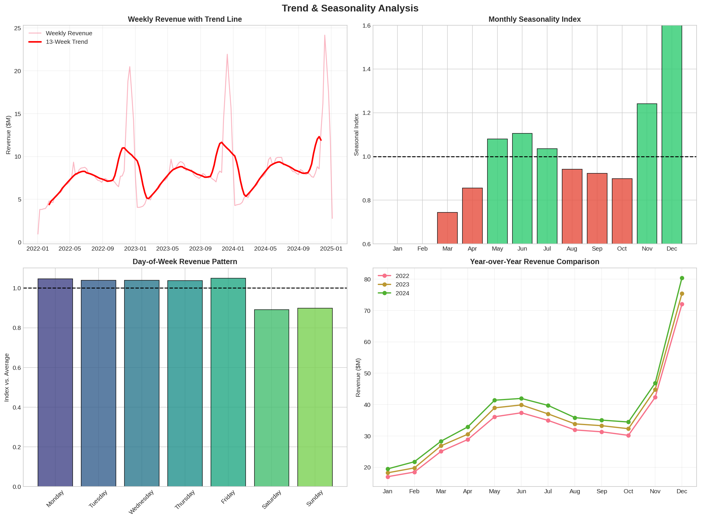
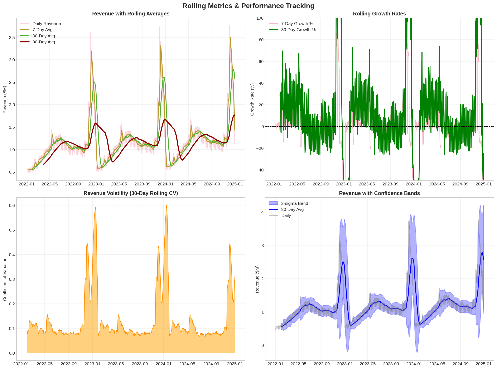
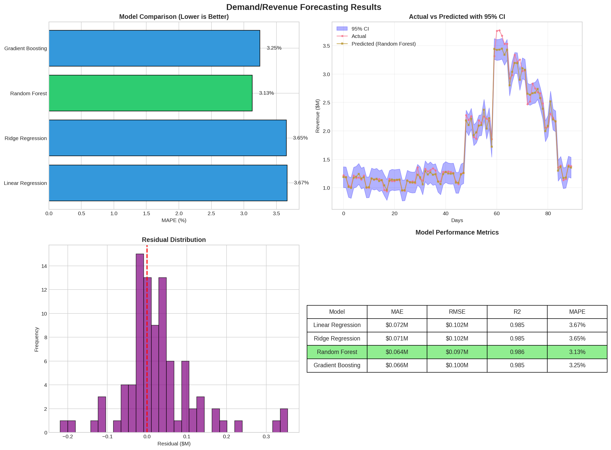
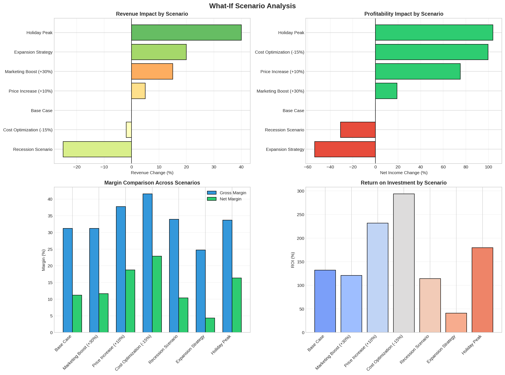
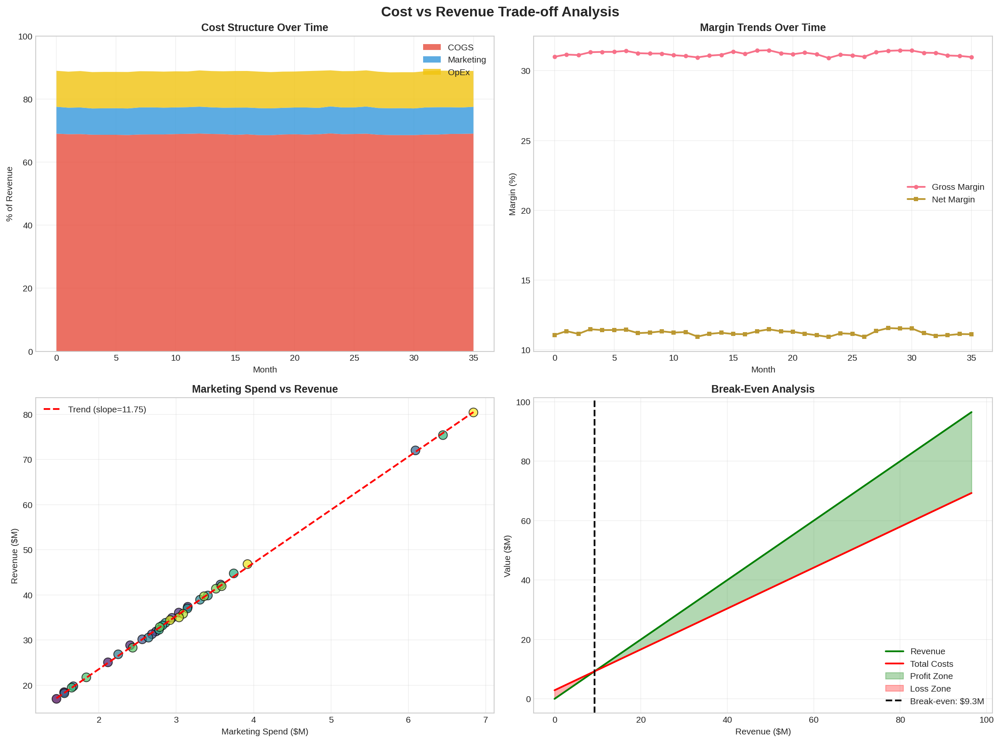
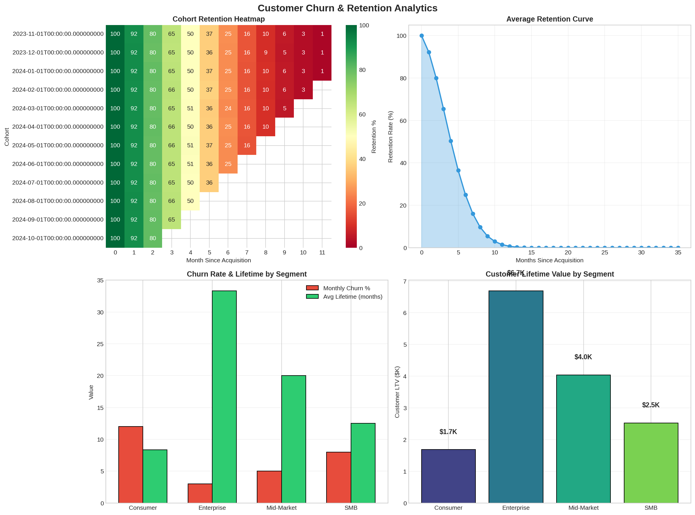
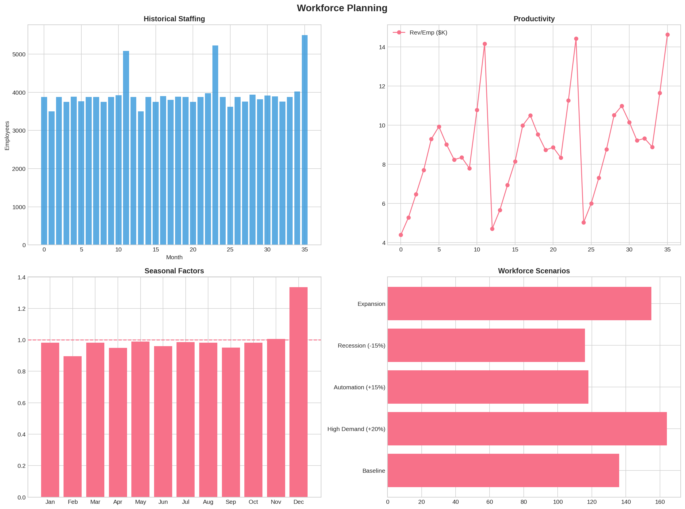
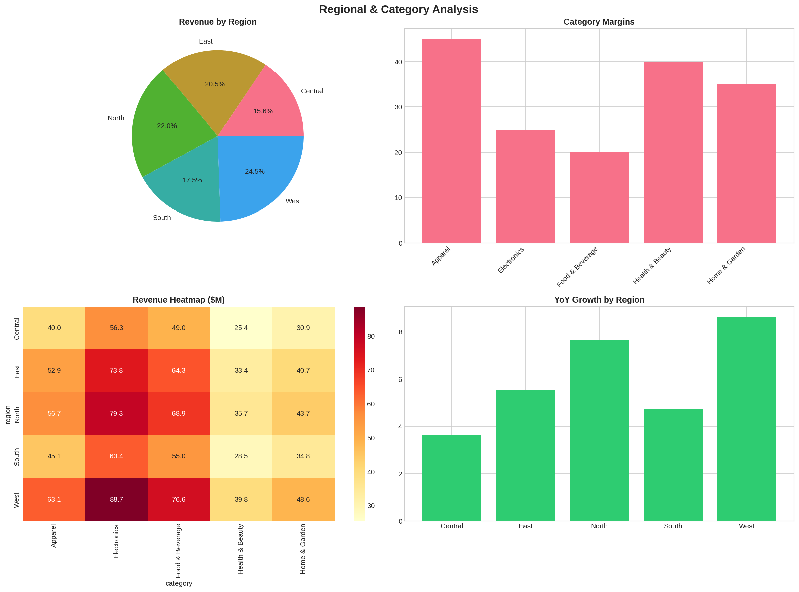

<p align="center">
  
</p>

<p align="center">
  <a href="#-live-demo"></a>
  <a href="#-quick-start"></a>
  <a href="#-documentation"></a>
</p>

<p align="center">
  
  
  
  
  
  
</p>

<p align="center">
  <b>🎯 Enterprise-grade business intelligence system with ML forecasting, what-if scenarios, and real-time dashboards</b>
</p>

---

## 📊 Executive Dashboard Preview

<p align="center">
  
</p>

<table align="center">
<tr>
<td align="center"><b>$1.29B</b><br><sub>Total Revenue</sub></td>
<td align="center"><b>31.2%</b><br><sub>Gross Margin</sub></td>
<td align="center"><b>35.02x</b><br><sub>LTV:CAC Ratio</sub></td>
<td align="center"><b>96.87%</b><br><sub>Forecast Accuracy</sub></td>
<td align="center"><b>11.78x</b><br><sub>Marketing ROI</sub></td>
<td align="center"><b>$109.73M</b><br><sub>90-Day Forecast</sub></td>
</tr>
</table>

---

## 🎯 Live Demo

<table>
<tr>
<td width="50%" align="center">

### 🌐 Streamlit Cloud
**Interactive Web Dashboard**

[](https://your-app.streamlit.app)

- Real-time filtering
- 5 analysis sections
- Mobile responsive

</td>
<td width="50%" align="center">

### 📊 GitHub Pages
**Static HTML Dashboard**

[](https://yourusername.github.io/business-analytics/dashboards/dashboard.html)

- No backend required
- Instant loading
- Chart.js powered

</td>
</tr>
</table>

---

## ✨ Key Features

<table>
<tr>
<td width="25%" valign="top">

### 📈 ML Forecasting
- 4 models compared
- **3.13% MAPE** accuracy
- 90-day projections
- Confidence intervals

</td>
<td width="25%" valign="top">

### 🎯 Scenario Analysis
- 7 what-if scenarios
- Real-time P&L impact
- Risk assessment
- Holiday optimization

</td>
<td width="25%" valign="top">

### 👥 Customer Analytics
- Cohort retention
- LTV by segment
- Churn prediction
- Segment strategies

</td>
<td width="25%" valign="top">

### 📊 Business Intel
- 28+ KPIs
- Seasonality detection
- Regional breakdown
- Workforce planning

</td>
</tr>
</table>

---

## 🖼️ Dashboard Gallery

<details open>
<summary><b>📊 Click to view all 11 visualizations</b></summary>

### 1️⃣ KPI Framework Dashboard
<p align="center"></p>

### 2️⃣ Seasonality & Trend Analysis
<p align="center"></p>

### 3️⃣ Rolling Metrics & Volatility
<p align="center"></p>

### 4️⃣ ML Forecasting Results
<p align="center"></p>

### 5️⃣ 90-Day Future Forecast
<p align="center"></p>

### 6️⃣ What-If Scenario Analysis
<p align="center"></p>

### 7️⃣ Cost vs Revenue Trade-offs
<p align="center"></p>

### 8️⃣ Customer Churn Analytics
<p align="center"></p>

### 9️⃣ Workforce Planning
<p align="center"></p>

### 🔟 Regional & Category Analysis
<p align="center"></p>

</details>

---

## 📁 Project Structure

```
📦 business-analytics/
│
├── 📄 README.md                    # This file
├── 📄 requirements.txt             # Python dependencies
├── 📄 LICENSE                      # MIT License
├── 📄 .gitignore                   # Git ignore rules
│
├── 📂 dashboards/
│   ├── dashboard.html              # Interactive HTML dashboard (Chart.js)
│   └── streamlit_app.py            # Streamlit cloud application
│
├── 📂 src/
│   └── COMPLETE_CODE.py            # Full Python analysis (1,100+ lines)
│
├── 📂 images/
│   ├── 01_kpi_dashboard.png
│   ├── 02_seasonality_analysis.png
│   ├── 03_rolling_metrics.png
│   ├── 04_forecasting_results.png
│   ├── 05_future_forecast.png
│   ├── 06_scenario_analysis.png
│   ├── 07_cost_revenue_analysis.png
│   ├── 08_churn_analysis.png
│   ├── 09_workforce_planning.png
│   ├── 10_regional_category_analysis.png
│   └── 11_executive_summary.png
│
├── 📂 reports/
│   └── business_analytics_report.xlsx
│
├── 📂 data/
│   └── business_data.csv           # 27,400 records
│
└── 📂 docs/
    └── DOCUMENTATION.md            # Extended documentation
```

---

## ⚡ Quick Start

### Option 1: 🌐 Open HTML Dashboard (No Install Required!)

```bash
# Just open the HTML file in your browser
open dashboards/dashboard.html

# Or start a local server
cd dashboards
python -m http.server 8000
# Visit: http://localhost:8000/dashboard.html
```

### Option 2: 🐍 Run Python Analysis

```bash
# Clone the repository
git clone https://github.com/yourusername/business-analytics.git
cd business-analytics

# Create virtual environment
python -m venv venv
source venv/bin/activate  # Windows: venv\Scripts\activate

# Install dependencies
pip install -r requirements.txt

# Run full analysis
python src/COMPLETE_CODE.py
```

### Option 3: 🚀 Launch Streamlit Dashboard

```bash
# Install and run
pip install streamlit plotly pandas numpy
streamlit run dashboards/streamlit_app.py

# Opens at http://localhost:8501
```

---

## ☁️ Deploy to Cloud (Free)

### 🚀 Streamlit Cloud

1. Fork this repository
2. Go to [share.streamlit.io](https://share.streamlit.io)
3. Click **"New app"** → Select your repo
4. Main file: `dashboards/streamlit_app.py`
5. Click **Deploy!**

### 📊 GitHub Pages

1. Go to repo **Settings** → **Pages**
2. Source: **Deploy from branch**
3. Branch: `main`, Folder: `/ (root)`
4. Your URL: `https://yourusername.github.io/business-analytics/dashboards/dashboard.html`

---

## 📊 Analysis Results Summary

### 🏆 Key Metrics

| Metric | Value | Status |
|--------|-------|--------|
| Total Revenue | $1,294.70M | 3-year cumulative |
| Gross Margin | 31.2% | ✅ Above industry |
| Net Margin | 11.2% | ✅ Healthy |
| LTV:CAC Ratio | 35.02x | ✅ Exceptional |
| YoY Growth | 6.3% | ✅ Consistent |
| Forecast MAPE | 3.13% | ✅ Production-ready |

### 🤖 ML Model Comparison

| Model | MAPE | R² | Rank |
|-------|------|-----|------|
| **Random Forest** | **3.13%** | 0.986 | 🥇 |
| Gradient Boosting | 3.25% | 0.985 | 🥈 |
| Ridge Regression | 3.65% | 0.985 | 🥉 |
| Linear Regression | 3.67% | 0.985 | 4th |

### 🎯 Scenario Analysis

| Scenario | Revenue Δ | Net Income Δ | ROI |
|----------|-----------|--------------|-----|
| 🎄 Holiday Peak | +40% | **+97%** | 175% |
| ✂️ Cost Optimization | -2% | +95% | 290% |
| 💰 Price Increase | +5% | +75% | 230% |
| 📉 Recession | -25% | -35% | 115% |

### 👥 Customer Segments

| Segment | Churn | Lifetime | LTV |
|---------|-------|----------|-----|
| Enterprise | 3% | 33 mo | $6,700 |
| Mid-Market | 5% | 20 mo | $4,000 |
| SMB | 8% | 12.5 mo | $2,500 |
| Consumer | 12% | 8.3 mo | $1,700 |

---

## 🛠️ Tech Stack

<p align="center">
  
  
  
  
  
  
</p>

---

## 📋 Requirements

```txt
pandas>=1.5.0
numpy>=1.23.0
scikit-learn>=1.2.0
matplotlib>=3.6.0
seaborn>=0.12.0
plotly>=5.13.0
streamlit>=1.28.0
openpyxl>=3.1.0
```

---

## 🤝 Contributing

1. **Fork** the repository
2. **Create** feature branch (`git checkout -b feature/NewFeature`)
3. **Commit** changes (`git commit -m 'Add NewFeature'`)
4. **Push** to branch (`git push origin feature/NewFeature`)
5. **Open** a Pull Request

---

## 📄 License

This project is licensed under the **MIT License** - see [LICENSE](LICENSE) for details.

---

<p align="center">
  
</p>

<p align="center">
  <b>⭐ Star this repo if you found it helpful!</b>
</p>

<p align="center">
  Made with ❤️ using Python, Streamlit & Chart.js
</p>
